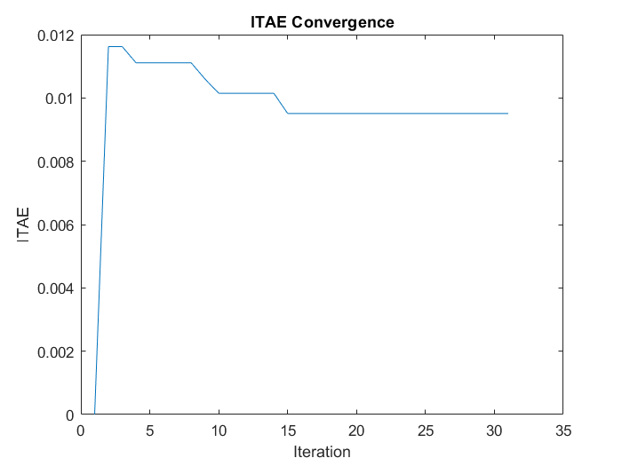
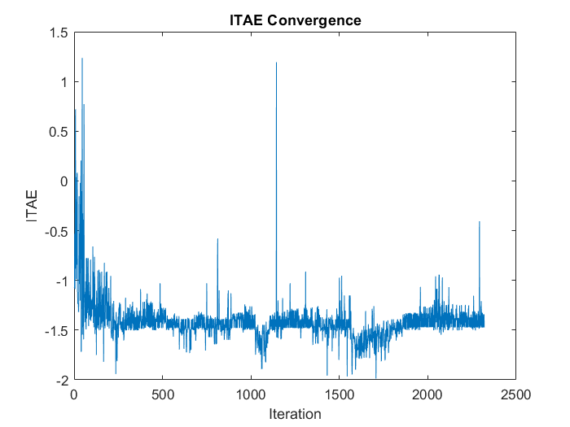
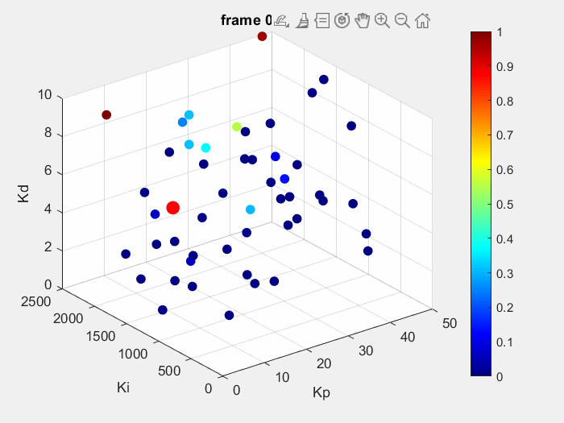

# GCRA-Based PID Tuner for Maglev System

This project implements a novel **Greater Cane Rat Algorithm (GCRA)** to tune PID controller parameters for a magnetic levitation (Maglev) system. The algorithm aims to minimize common time-domain performance indices, including ISE, IAE, ITSE, and ITAE. The system model is based on a real Maglev setup, and parameter bounds and penalties were derived from experimental testing.

## Objective

To optimize the PID gains (`Kp`, `Ki`, `Kd`) for a Maglev system using the bio-inspired GCRA, and compare the controller's performance across various time-domain objective functions.

## Algorithm

The **Greater Cane Rat Algorithm (GCRA)** is a nature-inspired metaheuristic optimization algorithm designed around the social and territorial behavior of greater cane rats during their mating season.

- **Exploration vs. Exploitation**: Controlled by parameter ρ, tuned to 0.5.
- **Dominant Male (Alpha)**: Guides search direction based on fitness.
- **Position Updates**: All rats update their positions relative to the alpha and their previous movements.

*Inspired by*:  
[“Greater cane rat optimization algorithm: A novel bio-inspired approach for global optimization problems”](https://www.sciencedirect.com/science/article/pii/S2405844024076606)

## System Details

- **Plant**: Magnetic Levitation (Maglev) system
- **Transfer Function**: Derived experimentally
- **PID Bounds**: Determined from physical constraints
- **Penalties**: Added in the objective functions for stability or constraint violations

## Objective Functions

Each function takes `Kp`, `Ki`, `Kd` as input:
- **ISE** - Integral of Squared Error
- **IAE** - Integral of Absolute Error
- **ITSE** - Integral of Time-weighted Squared Error
- **ITAE** - Integral of Time-weighted Absolute Error

## Project Structure

```plaintext
GCRA_PID_Tuner/
│
├── core/                  # Contains core algorithms
│   ├── gcra.m             # Main GCRA implementation
│   ├── fun_info.m         # Bounds, dimensions, and general info
│   ├── main.m             # Runs all 4 objective functions
│   └── main4.m            # Alternate minimal run
│
├── obj_functions/         # PID objective functions
│   ├── ISE.m
│   ├── IAE.m
│   ├── ITSE.m
│   └── ITAE.m
│
├── analysis/              # Analysis and comparison scripts
│   ├── plotting_all.m
│   └── test_inbuilt.m
│
├── animations_and_images/ # Visual results    
│   ├── animation.gif
│   ├── Convergence.png
│   ├── FineConvergence.png
│   └── gcra2.m            # Animation of rat movement and fine convergence 
│
└── README.md              
```

## Visual Outputs

### 🔹 Convergence After Each Iteration
Shows how the PID objective value (e.g., ITAE) reduces with each iteration of the GCRA.



---

### 🔹 Fine Convergence (Per Rat Movement)
Displays log₁₀(ITAE) values after each change in rat positions, capturing local fluctuations and improvements in fitness.



---

### 🔹 GCRA Search Animation
An animated visualization of how rats explore and converge toward the optimal PID gains over time.



## How to Run
1. Open MATLAB.

2. Set the project root folder (GCRA_PID_Tuner/) as the current directory.

3. Add necessary folders to path:

    ```
    addpath('core', 'obj_functions', 'analysis');
    ```
4. View results in the generated plots and console.

## Notes
All system and tuning parameters are based on real Maglev testing.

No external toolboxes are required except control toolboxes — works with base MATLAB.

Feel free to edit fun_info.m to adjust bounds or experiment with other systems.

## License
This project is open-source under the MIT License.